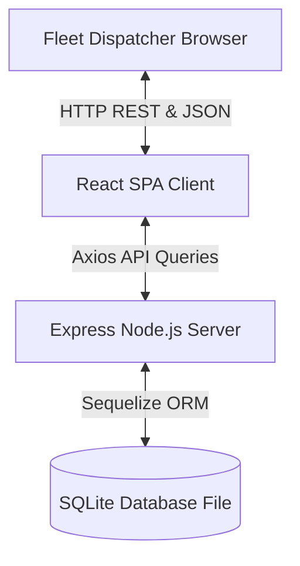

# TransitOps Enterprise Architecture

This document describes the high-level system architecture, client-server lifecycle, and technical abstractions implemented in the TransitOps Platform.

## System Topology

TransitOps is constructed as a decoupled Single Page Application (SPA) client communicating with a Node.js REST API service backed by a SQLite relational database.



## Module Abstractions

### 1. Client Architecture
- **Vite & React 18**: High-performance module bundling and declarative state tree.
- **Tailwind CSS & Glassmorphism**: Clean styling layer utilizing HSL color coordinates and responsive layout grids.
- **Framer Motion & Transitions**: Smooth micro-animations for page entries, slide-left drawers, and modal overlays.
- **Context API (Toasts)**: Unified, hook-based status dispatching engine.

### 2. Server Architecture
- **Express API routing**: Modular router segments exposing auth, vehicles, drivers, trips, and reports endpoints.
- **Sequelize ORM**: Relational schema mappings enforcing foreign-key integrity constraints, Cascade archives, and transaction gates.
- **SQLite Engine**: Compact single-file disk database storage.

## The Custom Serialization Pattern
To preserve database structural integrity and avoid schema migrations, extra enterprise attributes (e.g. Mechanic Name, Down Hours, Parts Billing, Vendor Invoice reference) are serialized within SQLite's standard text columns using a bracket-encapsulated serialization pattern:

```
[Field: Value, Field2: Value2]
```

### Parser Regex
The frontend matches and parses these properties in a unified selector utility:
```javascript
const parseMaintDesc = (desc) => {
  const match = desc.match(/(.*)\[Priority:\s*([^,]+),\s*Mechanic:\s*([^,]+),\s*PartsCost:\s*(\d+),\s*Downtime:\s*(\d+)\]/);
  // ... returns structured JSON attributes
};
```
This is fully compatible with existing legacy databases while enabling rich metadata ledgers.
