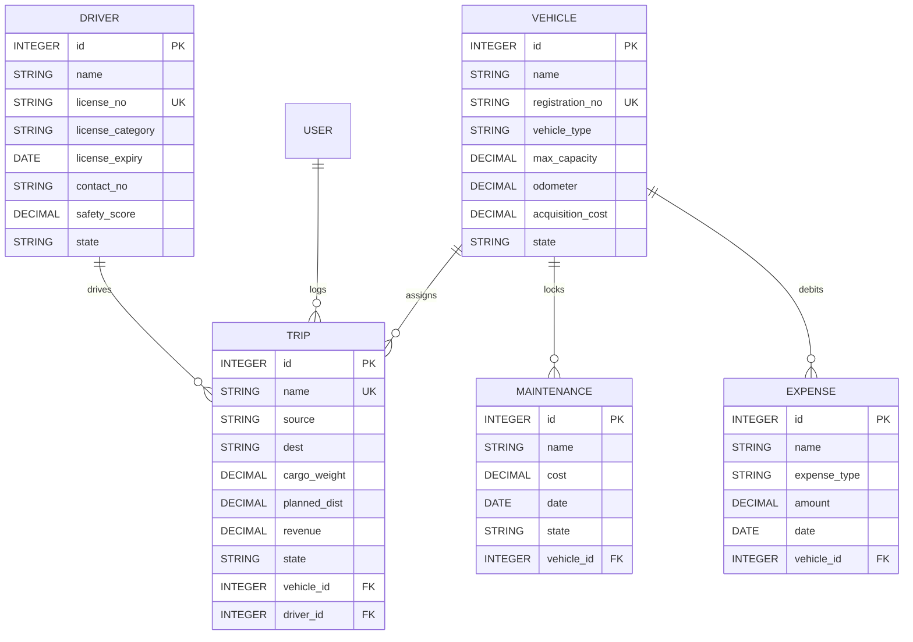

# TransitOps Database Schema Specification

This document details the SQLite database schemas, relations, and table constraints managed via the Sequelize ORM.

## Entity Relationship Model

## Schema Details

### 1. `vehicles`
- `registration_no`: Unique constraint. Restricts duplicate vehicle license logs.
- `state`: Enum values (`available`, `on_trip`, `in_shop`, `retired`). Default is `available`.

### 2. `drivers`
- `license_no`: Unique constraint. Restricts duplicate commercial licenses.
- `state`: Enum values (`available`, `on_trip`, `off_duty`, `suspended`). Default is `available`.

### 3. `trips`
- `vehicle_id` / `driver_id`: Foreign keys mapping back to assets tables. Cascade deletes are blocked to preserve commercial dispatch histories.
- `state`: Enum values (`draft`, `dispatched`, `completed`, `cancelled`). Default is `draft`.

### 4. `maintenances`
- Logs vehicle repair records. If state is `open`, the associated vehicle's state is locked as `in_shop` to block dispatch routes.

### 5. `expenses`
- Debits operational expenses (Fuel refill, Toll tickets, and other parts billing) to calculate vehicle ROI profitability index.
